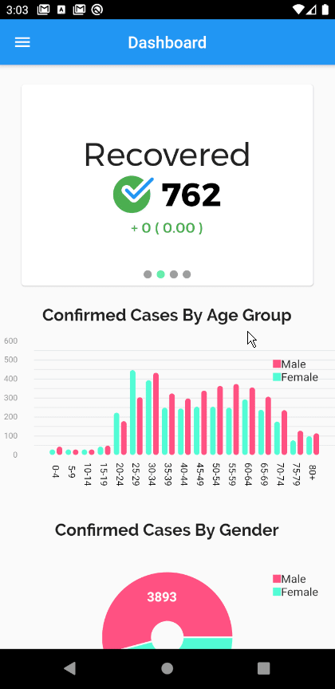
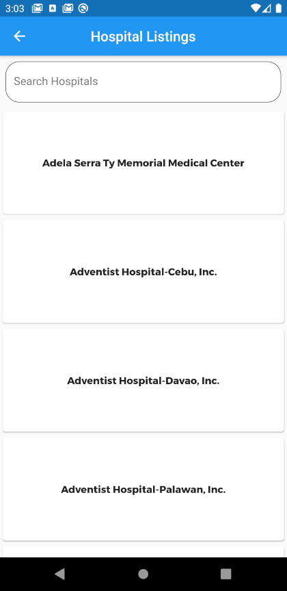

# NCOV Tracker PH

This app was build in order to provide information about the current situation in the Philippines.
The data that is shown in the app came from the Philippines Department of Health. I do not own the data nor claim it.

The app is built out of pure Flutter awesomeness.

## Special Thanks to:
 - @hyubs for creating an awesome api for keeping track of the COVID 19 in the Philippines.
 
## References
 - https://ncovph.com/ (Api)
 - https://endcov.ph/ (Hospital Directories)

## Preview
### Overview

### Hospital Listings

## Features:
- The app will notify users when it detects if the number of cases has changed in the Philippines
- The app contains hospital directories with their corresponding contact numbers
- The app has detailed graphs that are related to Covid 19

